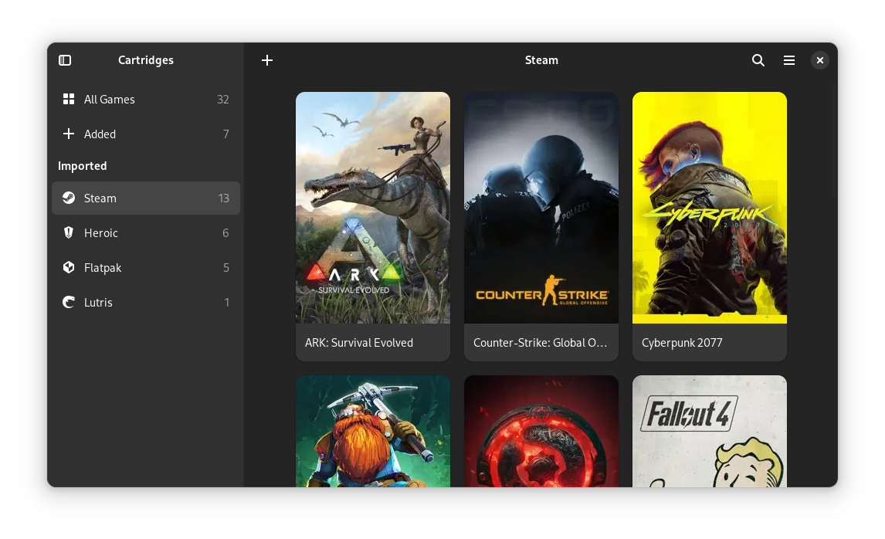

[circle-url]: https://circle.gnome.org
[circle-image]: https://circle.gnome.org/assets/button/badge.svg
[weblate-url]: https://hosted.weblate.org/engage/cartridges/
[weblate-image]: https://hosted.weblate.org/widgets/cartridges/-/cartridges/svg-badge.svg

  

  # 🐦‍⬛ Dark Cartridges 🐦‍⬛

  A fork of Cartridges which goal is running piracy games on linux like a charm

  [![GNOME Circle][circle-image]][circle-url]
  [![Translation Status][weblate-image]][weblate-url]

  

# The Project

The goal of the project is to simplify the process of launching pirated games, including online fixes, on Linux.

## Features

- Everything that is included in the original cartridges.

- Automatic installation and use of the Umu Launcher for online games.
- Automated installation of additional libraries in Proton prefix.

# Installation

## 🐧 Linux 🐧
The application is currently in development. As soon as we have a more stable version, we will release the Flatpak package.

# Code of Conduct

The project follows the [GNOME Code of Conduct](https://conduct.gnome.org/).

See [CODE_OF_CONDUCT.md](https://github.com/kra-mo/cartridges/blob/main/CODE_OF_CONDUCT.md).
